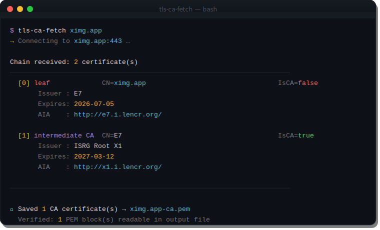
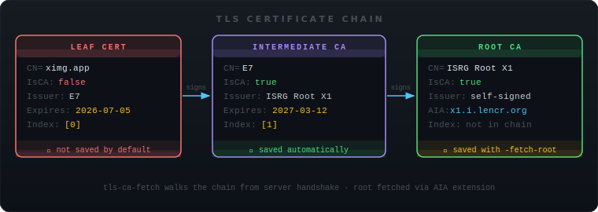

# tls-ca-fetch

**Extract and save CA certificates from any TLS server — one command, no OpenSSL gymnastics.**

`tls-ca-fetch` connects to a hostname over TLS, walks the certificate chain the server presents, and writes the CA certificate(s) to a PEM file. It can also chase the AIA extension to fetch the root CA directly from the issuer's URL. Zero dependencies, single static binary.





---

## Install

### Download a pre-built binary

```bash
# Linux (amd64)
curl -Lo tls-ca-fetch https://github.com/binRick/tls-ca-fetch/raw/main/releases/v1.0.0/tls-ca-fetch-linux-amd64
chmod +x tls-ca-fetch
sudo mv tls-ca-fetch /usr/local/bin/

# macOS (Apple Silicon)
curl -Lo tls-ca-fetch https://github.com/binRick/tls-ca-fetch/raw/main/releases/v1.0.0/tls-ca-fetch-darwin-arm64
chmod +x tls-ca-fetch
sudo mv tls-ca-fetch /usr/local/bin/

# macOS (Intel)
curl -Lo tls-ca-fetch https://github.com/binRick/tls-ca-fetch/raw/main/releases/v1.0.0/tls-ca-fetch-darwin-amd64
chmod +x tls-ca-fetch
sudo mv tls-ca-fetch /usr/local/bin/

# Windows (amd64) — download and add to PATH
# releases/v1.0.0/tls-ca-fetch-windows-amd64.exe
```

### Build from source

Requires Go 1.22+.

```bash
git clone https://github.com/binRick/tls-ca-fetch.git
cd tls-ca-fetch
make build          # → ./tls-ca-fetch
```

### Cross-compile all platforms

```bash
make cross          # → releases/v1.0.0/tls-ca-fetch-{linux,darwin,windows}-{amd64,arm64}
```

Or via Docker (no local Go needed):

```bash
./build.sh
```

---

## Usage

```
tls-ca-fetch [flags] <hostname> [port]
```

| Flag | Default | Description |
|------|---------|-------------|
| `-port` | `443` | TLS port to connect to |
| `-o` | `<hostname>-ca.pem` | Output file path (`-` for stdout) |
| `-all` | off | Save full chain including leaf certificate |
| `-fetch-root` | off | Chase AIA extension to fetch root CA |
| `-insecure` | off | Skip TLS certificate verification |
| `-timeout` | `10` | Connection timeout in seconds |
| `-version` | — | Print version and exit |

---

## Examples

### Grab the CA cert from a public site

```bash
tls-ca-fetch github.com
```

```
→ Connecting to github.com:443 …

Chain received: 2 certificate(s)
──────────────────────────────────────────────────────────────────────
  [0] leaf             CN=github.com                             IsCA=false
       Issuer : DigiCert TLS Hybrid ECC SHA384 2020 CA1
       Expires: 2026-03-26

  [1] intermediate CA  CN=DigiCert TLS Hybrid ECC SHA384 2020   IsCA=true
       Issuer : DigiCert Global Root CA
       Expires: 2031-04-13
       AIA    : http://cacerts.digicert.com/DigiCertGlobalRootCA.crt
──────────────────────────────────────────────────────────────────────

✓ Saved 1 CA certificate(s) → github.com-ca.pem
  Verified: 1 PEM block(s) readable in output file
```

### Write to stdout (pipe into another tool)

```bash
tls-ca-fetch -o - internal.corp.example | openssl x509 -noout -text
```

### Fetch the full chain including the leaf

```bash
tls-ca-fetch -all -o chain.pem api.example.com
```

### Chase AIA to also grab the root CA

```bash
tls-ca-fetch -fetch-root -o full-chain.pem smtp.example.com 587
```

### Non-standard port

```bash
# Port as flag
tls-ca-fetch -port 8443 internal.example.com

# Port as positional arg
tls-ca-fetch internal.example.com 8443
```

### Self-signed / private CA server

```bash
tls-ca-fetch -insecure -o my-internal-ca.pem vault.internal
```

### Trust a fetched CA immediately (Linux)

```bash
tls-ca-fetch corp-proxy.internal
sudo cp corp-proxy.internal-ca.pem /usr/local/share/ca-certificates/corp-proxy.crt
sudo update-ca-certificates
```

---

## How it works

1. Opens a raw TLS connection to `hostname:port`
2. Reads the `PeerCertificates` slice from the TLS handshake state — no HTTP, no SNI tricks needed
3. Prints a summary of every certificate in the chain (role, CN, issuer, expiry, AIA URL)
4. Filters out the leaf cert (unless `-all`) and writes remaining CA certs as concatenated PEM blocks
5. If `-fetch-root` is set, fetches the DER cert at the topmost certificate's AIA URL, parses it, and appends it to the output

---

## Certificate roles

| Role | Meaning |
|------|---------|
| `leaf` | End-entity cert — presented by the server, not saved by default |
| `intermediate CA` | Signed by the root, signs the leaf — saved |
| `root CA` | Self-signed, trust anchor — only included via `-fetch-root` or if the server sends it |

---

## Building releases

The `build.sh` script uses a Docker `golang:1.22-alpine` container so you get reproducible, CGO-disabled, stripped binaries without needing Go on the host:

```bash
VERSION=v1.1.0 ./build.sh
```

Output lands in `releases/v1.1.0/`.

---

## License

MIT
